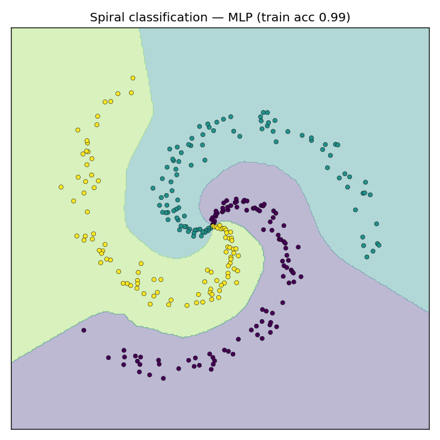
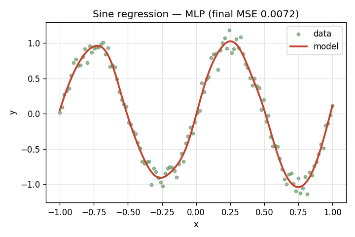
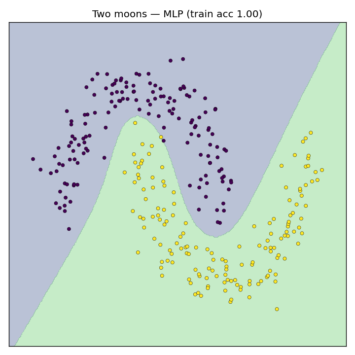
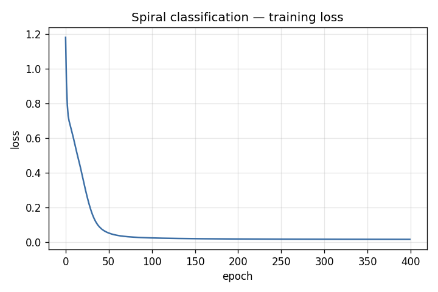
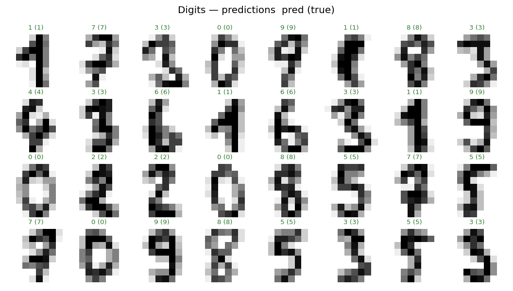
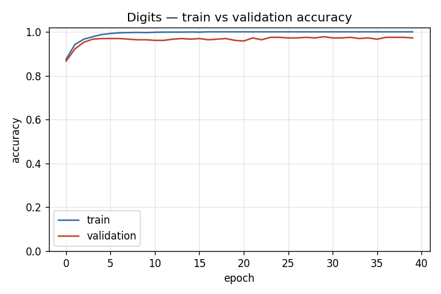
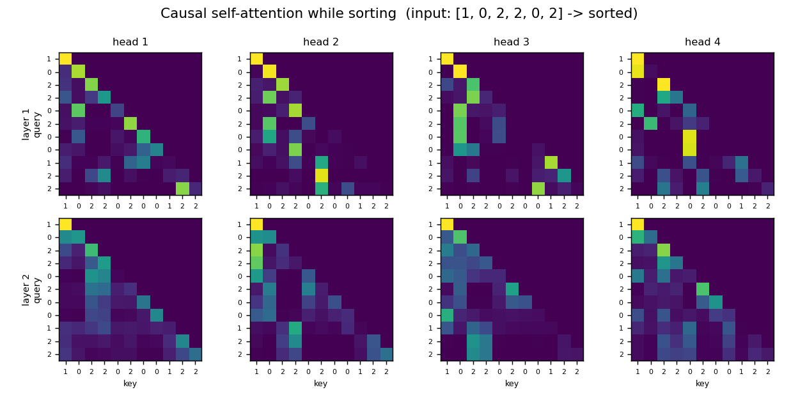

# nanograd

[](https://github.com/AlanoHater/nanograd/actions/workflows/ci.yml)
[](https://www.python.org/)
[](LICENSE)

**A tiny reverse-mode automatic differentiation engine and neural-network library, written from scratch in NumPy.**

`nanograd` implements the core machinery behind modern deep-learning frameworks
(PyTorch, TensorFlow, JAX) in a few hundred lines of readable Python: a dynamic
computation graph, backpropagation, common layers, loss functions and
optimizers. It depends only on NumPy. The goal is **understanding how deep
learning actually works under the hood** — not raw performance.

The same engine scales all the way up to **multi-head self-attention and a small
Transformer**, trained with gradients it computes itself.

Every gradient in the engine is verified against numerical finite differences
(*gradient checking*), so the math is provably correct, not just plausible.

---

## Results

A multi-layer perceptron built with `nanograd`, trained purely with gradients
produced by the engine:

| Spiral classification (3 classes) | Sine regression |
|:---:|:---:|
|  |  |
| **99.3%** train accuracy on a non-linearly-separable dataset | Fits a noisy sine wave down to the noise floor |

| Two-moons classification | Training loss |
|:---:|:---:|
|  |  |

**Real data — hand-written digits** (8×8 images, 10 classes): a deeper network
with BatchNorm, Dropout and a cosine learning-rate schedule, trained with
mini-batches, reaches **~97% validation accuracy**.

| Predictions — `pred (true)` | Train vs validation accuracy |
|:---:|:---:|
|  |  |

**Attention from scratch** — a decoder-only Transformer with causal multi-head
self-attention, trained on a toy *sorting* task, reaches **100% exact-match
accuracy**. Its learned attention maps are interpretable and strictly causal
(nothing above the diagonal):



All figures above are produced by the scripts in [`examples/`](examples/).

---

## Features

- **Reverse-mode autodiff** over n-dimensional NumPy arrays with full
  broadcasting support ([`tensor.py`](nanograd/tensor.py)).
- **Operations**: `+ - * / @ **` (incl. batched matmul), `sum`, `mean`, `exp`,
  `log`, `reshape`, `transpose`, `softmax`, and activations `relu`, `tanh`,
  `sigmoid`.
- **Layers**: `Linear` (He/Xavier init), `ReLU`, `Tanh`, `Sigmoid`,
  `BatchNorm1d`, `Dropout`, and `Sequential`, with `train()` / `eval()` modes
  ([`nn.py`](nanograd/nn.py)).
- **Transformers**: `LayerNorm`, `Embedding`, `MultiHeadSelfAttention` (causal),
  `TransformerBlock` and a `TinyTransformer`, all on the same engine
  ([`attention.py`](nanograd/attention.py)).
- **Losses**: MSE, softmax cross-entropy, and a sequence cross-entropy with
  `ignore_index`.
- **Optimizers**: `SGD` (momentum + weight decay) and `Adam`, plus `StepLR`
  and `CosineAnnealingLR` schedulers ([`optim.py`](nanograd/optim.py)).
- **Training utilities**: synthetic datasets, mini-batch iteration,
  standardization and train/test split ([`utils.py`](nanograd/utils.py)).
- **Tested**: 65 tests including gradient checking for every operation and
  end-to-end training tests (MLP and Transformer).

---

## Quick start

```bash
git clone https://github.com/AlanoHater/nanograd.git
cd nanograd
pip install -r requirements-dev.txt   # numpy, matplotlib, pytest

python -m pytest                      # run the 65-test suite
python examples/spiral_classification.py
python examples/digits_classification.py   # real data (needs scikit-learn)
python examples/sort_transformer.py        # train a Transformer to sort
```

### Train a neural network in a few lines

```python
import nanograd as ng
from nanograd import nn, optim, utils

ng.manual_seed(0)
x, y = utils.make_spiral(n_points=100, n_classes=3)   # non-linear toy data

model = nn.Sequential(
    nn.Linear(2, 64), nn.ReLU(),
    nn.Linear(64, 64), nn.ReLU(),
    nn.Linear(64, 3),
)
opt = optim.Adam(model.parameters(), lr=1e-2)

inputs = ng.Tensor(x)
for epoch in range(300):
    opt.zero_grad()
    loss = nn.cross_entropy(model(inputs), y)   # forward
    loss.backward()                             # backprop (autodiff)
    opt.step()                                  # gradient descent

print("accuracy:", utils.accuracy(model(inputs), y))
```

---

## How it works

`nanograd` builds a **computation graph** as you operate on tensors. Each
`Tensor` remembers the tensors it was produced from and a small `_backward`
closure implementing the chain rule for that single operation.

Take `z = x * y`. The forward value is `x * y`; the local derivatives are
`∂z/∂x = y` and `∂z/∂y = x`. When a gradient `∂L/∂z` arrives from downstream,
the closure routes it to the inputs:

```
x.grad += y * z.grad      # ∂L/∂x = ∂L/∂z · ∂z/∂x
y.grad += x * z.grad      # ∂L/∂y = ∂L/∂z · ∂z/∂y
```

Calling `loss.backward()` performs a **reverse topological traversal** of the
graph from the scalar loss, running each node's closure exactly once so every
parameter ends up with the correct accumulated gradient. The optimizer then
nudges each parameter against its gradient. That single loop —
*forward → backward → step* — is all of supervised deep learning.

Broadcasting is handled by summing gradients back down to each operand's
original shape (see `_unbroadcast` in [`tensor.py`](nanograd/tensor.py)).

---

## Why gradient checking matters

A from-scratch autodiff engine is only useful if its derivatives are correct.
For every operation, [`tests/test_tensor.py`](tests/test_tensor.py) compares the
analytical gradient from `backward()` against a numerical estimate using central
differences:

$$\frac{\partial f}{\partial x} \approx \frac{f(x + \epsilon) - f(x - \epsilon)}{2\epsilon}$$

If the chain-rule bookkeeping were wrong, these tests would fail. This is the
same technique used to debug real deep-learning frameworks.

---

## Transformers, built on the same engine

Attention is just matrix multiplies, a softmax and residual adds — so the
Transformer layers in [`attention.py`](nanograd/attention.py) need **no custom
backward code**. `loss.backward()` differentiates the whole model automatically.

```python
import nanograd as ng
from nanograd import nn, optim, utils
from nanograd.attention import TinyTransformer

ng.manual_seed(0)
length, vocab = 6, 3
x, y = utils.make_sort_dataset(4000, length, vocab)   # learn to sort digits

model = TinyTransformer(vocab, block_size=2 * length - 1,
                        d_model=64, n_heads=4, n_layers=2)
opt = optim.Adam(model.parameters(), lr=3e-3)

for xb, yb in utils.iterate_minibatches(x, y, 64):
    opt.zero_grad()
    nn.cross_entropy_seq(model(xb), yb).backward()
    opt.step()
```

`model.attention_maps()` returns the per-layer attention weights that produced
the heatmaps shown above.

---

## Project structure

```
nanograd/
├── nanograd/            # the library (NumPy only)
│   ├── tensor.py        # autodiff engine: Tensor + backward()
│   ├── nn.py            # layers (Linear, BatchNorm, Dropout, LayerNorm, ...)
│   ├── attention.py     # self-attention, TransformerBlock, TinyTransformer
│   ├── optim.py         # SGD, Adam + LR schedulers
│   ├── utils.py         # datasets, mini-batches, metrics
│   └── _random.py       # reproducible RNG (manual_seed)
├── examples/            # runnable demos that produce the figures above
├── tests/               # 65 tests, incl. gradient checking
├── assets/              # generated figures
└── .github/workflows/   # CI: tests on Python 3.10 / 3.11 / 3.12
```

---

## Possible extensions

- Convolutional layers (`Conv2d`) via im2col
- Recurrent layers (RNN / LSTM)
- A scalar-valued "engine mode" to visualize the computation graph
- Loading larger datasets (e.g. the full MNIST)

---

## License

[MIT](LICENSE) © 2026 AlanoHater
